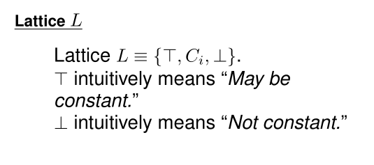
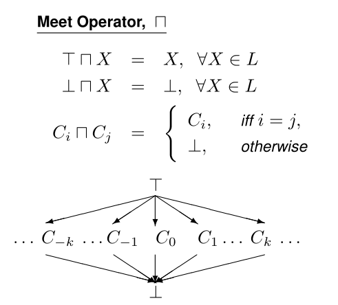
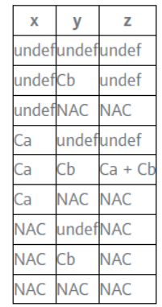
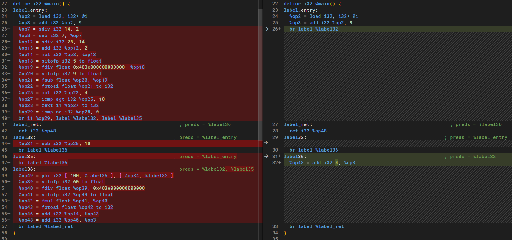
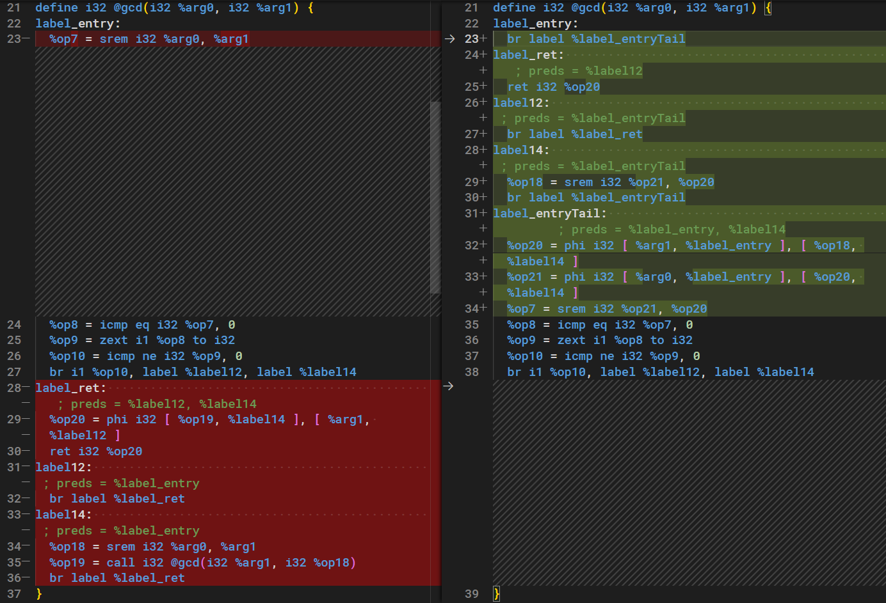
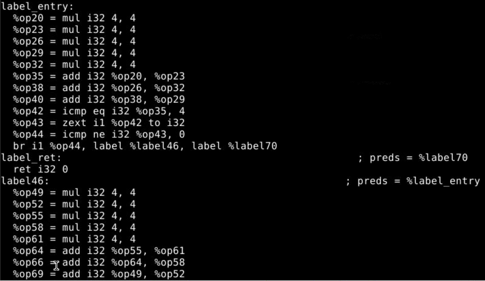
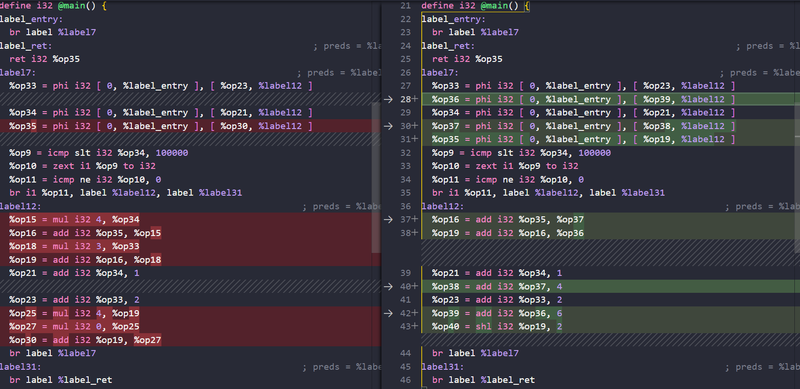
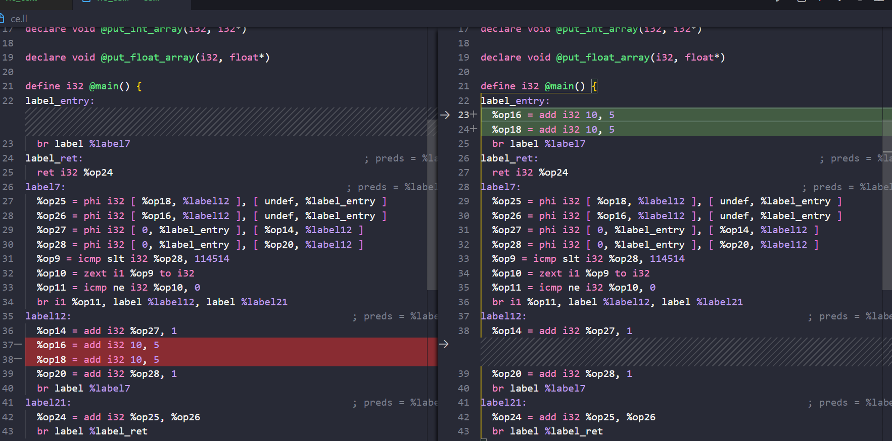

# 进阶优化提交报告

## 概述

我们做了如下优化：常量折叠，尾递归优化，公共子表达式删除，强度削弱，循环代码外提。希望通过优化，提升汇编代码性能。

## 优化1-常量折叠

常量折叠是一种常见的优化技术，我们选择实现该技术较为高级的形式：有条件的常数传播（sparse conditional constant propagation，下称SCCP）

### 优化的设计思想

SCCP的主要思想类似于其他相似的数据流分析，主要焦点在于一条指令是否是常量以及块与块之间的边是否可能进行；一条指令是否是常量可以将常量进行替换，块与块之间的边是否可能进行将可以排除一些不可能发生的基本块，从而实现死代码消除

对于每个指令，我们先定义其具有一个格如下



而其运算关系如下，该运算关系主要运用于基本块中的 `phi` 指令，因为 `phi` 指令的操作数的前驱基本块可能不会被运行，故定义该格的运算如下



而对于一般的二元运算符 `+` ，定义 `z=x+y` 的转移关系如下



有了上面的定义可以给出具体的思路如下

- 初始化：所有指令的返回值 `op` 都定义为 `Unknown` ，所有 CFG 的边都定义为不可达
- 循环：使用两个工作列表：
    - FlowWL：每个 CFG 的边被判定为可能执行后加入该表
    - SSAWL：根据上面格的运算规则更改 def 后，当 def 改变时，将 use 加入该列表
- 终止：两个列表均空时结束
- 后续：根据上面的结果删除常量 `op` 与不可能执行的基本块

伪代码如下：

```
SCCP()
    // execFlags存储已经处理过的 CFG edge ，排除重复处理的情况
    Initialize(ExecFlags[], LatCell[], FlowWL, SSAWL);
    while ((Edge E = GetEdge(FlowWL ∪ SSAWL)) != 0)
        if (E is a flow edge && ExecFlag[E] == false)
            ExecFlag[E] = true
            VisitPhi(φ) ∀ φ ∈ E->sink
            if (first visit to E->sink via flow edges)
                VisitInst(E->sink)
            if (E->sink has only one outgoing flow edge Eout)
                add E_out to FlowWL
        else if (E is an SSA edge)
            if (E->sink is a φ node)
                VisitPhi(E->sink)
            else
                VisitInst(E->sink)
    delete const op and infeasible BB.

VisitPhi(φ) :
    for (all operands Uk of φ)
        if (ExecFlag[InEdge(k)] == true)
            LatCell(φ) ⊓ = LatCell(Uk)
        if (LatCell(φ) changed)
            add SSAOutEdges(φ) to SSAWL

VisitInst(S) :
    if(S is branch Inst)
        deal with branch
    val = Evaluate(S)
    LatCell(S) = val
    if (LatCell(S) changed)
        add SSAOutEdges(S) to SSAWL
```

### 代码实现上的结构考虑

首先需要实现一个上面提到的格，可以生成并获取其中的内容，并定义两个操作运算`operator+`和`operator*`，分别实现phi指令的meet运算与二元运算符的转移关系

```cpp
enum LatticeType
{
    Unknown,
    Constant,
    NotConstant
};
class Lattice
{
public:
    //...
    // 在 phi 指令中对 Lattice 之间进行 meet
    Lattice operator+(Lattice const &other) const;
    // 两个操作数的 Lattice 判断操作后的值其 Lattice 类型是什么
    LatticeType operator*(Lattice const &other) const;
    //...

private:
    LatticeType type;
    bool isInt = false;
    int i = 0;
    float f = 0;
};
```

算法部分结构如同上面的伪代码

### 实现关键点分析

在主函数部分，定义下面这些重要变量

```cpp
    // Value * 到 Lattice 的映射，存储每个Value对应的Lattice
    std::map<Value *, Lattice> latCell;
    // SSA 的 worklist
    std::vector<Instruction *> SSAWL;
    // CFG edge 的 worklist
    std::vector<std::pair<BasicBlock *, BasicBlock *>> flowWL;
    // 存储已经处理过的 CFG edge ，排除重复处理的情况
    std::set<std::pair<BasicBlock *, BasicBlock *>> execFlags;
```

主循环函数主要由两个循环组成，首先处理 `flowWL` ，该表为空后开始处理`SSAWL`，处理完毕后判断处理过程中是否添加了新的`flowWL`，如此重复直到判断 `SSAWL` 与 `flowWL` 均为空。`execFlags`主要用在`flowWL`的循环中判断该边是否已经处理过。

对于删除代码与基本块部分，对于判定为常量的指令将其所有use替换为常量，并将该指令删除；而不会运行的基本块主要根据`branch`指令的`cond`是否为常量判断，若是，则替换为绝对跳转，并处理前驱后继以及phi指令关系，并将前驱为空的块删除

### 优化前后的性能评测分析



上图为一个简单的常量传播样例，其中除了将常量进行传播，对于不会被执行到的`label35`标识的基本块也同样被删除

### 实验中遇到的困难

理解其原理，并构造合适的数据结构用于完成该pass

### 参考文献

[CS 426 Topic 5: SSA and the SSA Construction Algorithm](https://piazza.com/class_profile/get_resource/hzkq9i9o1ec222/i0iiojubk971th)

[什么是编译器中的常量传播？](https://zhuanlan.zhihu.com/p/552900688)


## 优化2-尾递归优化

尾递归优化是通过简化函数调用栈的结构而获得性能优化的一种编译器优化

### 优化的设计思想

主要思想在于将返回调用函数自身`call`指令所得到的返回值的ret语句转化为重新设置函数参数并返回到开头的jmp指令，从而达到减少栈调用的优化效果

### 代码实现上的结构考虑

因为该优化存在较大的CFG变化以及较多的变量存储，故选择在Mem2Reg的优化流程之前进行。因此在实现的过程中需要根据未优化代码的结构特点进行总结和利用

而在具体的实现上，主要存在几个工作：
1. 将`entry`的基本块分割为两部分，partA包含所有的`alloca`指令以及函数参数的`store`指令，partB为原本的`entry`剩下的部分，包括局部变量的赋值以及函数开头的一部分代码。做好该工作后后面优化的jmp将跳转到partB
2. 找出符合 `return fun(a,...)` 的位置，并将函数调用的参数转化为`store`到`alloca`出来的参数的位置，修改前驱后继后在该基本块尾部添加到达partB的`branch`指令

### 实现关键点分析

该pass为了简化设计流程选择在Mem2Reg前运行，因此处理的都是未经过优化的代码，此时的代码结构与基本块之间的前驱后继关系，基本块中的位置有很大关系，也因此借用该关系简化了流程。比如`entry`块第一条指令是`ret`的`alloca`，之后每两条是参数的`alloca`和`store`，通过这个关系可以获取到ret和arg的位置。同时也可以通过`label_ret`的前驱中对`ret`的`store`是返回的值来判断是否是尾调用

伪代码如下

```
tailCall(fun):
    if(根据函数类型判断不可能存在尾递归)
        return
    获取 ret 和所有 arg 的存储地址
    for(所有ret基本块的前驱preBB)
        for(preBB所有的指令inst)
            if(inst为store指令
            && 存入的值为call指令
            && call的函数为正在处理的函数fun
            && 存入的位置为ret的存储地址)
                将preBB和storeIns存入workList
    if(workList为空)
        return
    将 entryBB 分裂为两块
    for (在workList中的workBB, storeIns)
        删除该workBB的跳转指令，并处理前驱后继关系
        为函数调用每个arg安排`store`指令存入对应的存储单元
        删除callIns和storeIns
        加入跳转到entryBB后半部分的br指令
```

### 优化前后的性能评测分析



左侧label14的函数调用转化为右侧label14跳转到partB，说明实现了对于直接尾调用的优化

### 参考文献

《编译原理和技术》09-optimize.pdf——张昱

## 优化3-本地公共子表达式删除

### 优化的设计思想

公共子表达式删除，又称 CSE（Common subexpression elimination），编译器会视情况将多个相同的表达式替换成一个变量，这个变量存储着计算该表达式后所得到的值。

而本地公共子表达式删除，则是在基本快内进行上述优化，不考虑基本块之间的重复表达式。

由于在基本快内，代码是顺序执行，所以实现思路比较简单，只需记录在当前基本块内执行到当前指令时，已经遇到过哪些表达式，然后判断当前指令是否是表达式，如果是，执行：

+ 如果当前表达式之前出现过，那么将其删除，其后续的引用则使用该表达式第一次出现的指令代替。
+ 如果当前表达式没有出现过，则加入记录中

### 代码实现上的结构考虑

使用 set 记录当前出现过那些表达式，set 的元素是指令。

此外，需要额外写一个判断两个表达式指令是否计算的是同一个表达式的函数。

### 实现关键点分析

判断两个表达式是否相等时，首先判断运算符，若运算符相等， 再判断操作数的个数以及是否两两相等。

值得注意的是，如果操作数是常量，由于是新生成的常量，所以即使两个操作数常量的值相等，这两个操作数也不相等。所以需要特殊判断常量的相等。

### 优化前后的性能评测分析

我们提供了一个测试文件 `cse1.sy`，其中一个基本块内计算了 `e*f` 四次，只开 `-O` 而不开本地公共子表达式删除时，该基本块生成的汇编代码为：


开启本地公共子表达式删除后：


### 参考文献

《编译原理和技术》09-optimize.pdf——张昱

## 优化4-全局公共子表达式删除

### 优化的思想

将公共子表达式删除不仅局限于一个基本块内，而是放在整个 function 中，考虑不同基本块之间可能有重复计算的表达式。

需要考虑基本块之间的前驱后继关系，重复出现的表达式保留哪个删除哪个，而且基本块之间的关系可能不是线性的，所以即使两个基本块出现了重复的表达式，也未必其中一个可以被另一个代替。

所以，分析不同基本块的表达式之间的关系是全局公共子表达式删除的关键，这一部分用**可用表达式分析**来完成。

计算出每个基本块入口的可用表达式后，遍历该基本块中的指令，如果当前指令是表达式指令，而且该基本块的入口可用表达式以及基本块内该指令之前的指令没有对当前表达式的计算，那么这个表达式就需要被保留，否则可以删除。

### 代码结构上的考虑

相比于基本块内的优化，全局公共子表达式不一定只保留第一次计算，或者说，有些表达式在全局中有多处“第一次计算”，所以用第一次计算的指令代表表达式的方法不可行，需要新建一个数据结构，它需要记录表达式指令的运算符、操作数以及第一次计算该表达式的指令。

大概结构如下：

```c++
typedef struct Expression {
    Instruction::OpID opcode;
    std::vector<Value *> operands;
    std::list<Instruction *> Finsts;
    Expression(Instruction *inst){
        Finsts.push_back(inst);
        opcode = inst->get_instr_type();
        operands = inst->get_operands();
    }
};
```

由于要做可用表达式分析，所以数据流分析中使用到的集合采用 set，方便取交并差集。

每个基本块都需要一个 IN、OUT、gen、kill 集合，所以用 map 来记录基本块与其相应的集合之间的联系。

### 实现关键点分析

#### 1. 整体流程

整体运行流程是：首先做可用表达式分析，然后查找并记录不能被删除的表达式指令，最后删除可删除的表达式指令。

#### 2. 可用表达式分析

可用表达式分析用到的集合为：

+ e_gen_B：基本块 B 所生成的可用表达式的集合
+ e_kill_B：基本块 B 所杀死的可用表达式的集合
+ IN[B]：块 B 入口的可用表达式集合
+ OUT[B]：块 B 出口的可用表达式集合

e_gen_B 的计算：顺序扫描每条指令，若为表达式指令 `z = x op y`

+ 把 `x op y` 加入到 e_gen_B，从 e_gen_B 中删除和 z 相关的表达式

e_kill_B 的计算：顺序扫描每条指令，若为表达式指令 `z = x op y`

+ 从 e_kill_B 中删除表达式 `x op y`，把所有和 z 相关的表达式加入到 e_kill_B 中

可用表达式分析的数据流等式为：
$$
OUT[B] = e\_gen_B ∪(IN[B]-e\_kill_B)
\\
IN[B] = ∩_{P是B的前驱}OUT[p]
$$
迭代上述方程，伪代码为：


#### 3. 判断表达式指令是否可删除

在计算出每个基本块的入口可用表达式后，就可以判断其中的每条表达式指令是否可删除。

如果当前块的 IN[B] 包含了该指令的表达式，或者当前指令之前的块内指令计算了

#### 4. 首次计算不止一处的表达式

加入到该表达式的第一次计算集合中。

对于这种代码，剩下的可删除表达式指令在删除前，需要生成一个 phi 指令，引用该表达式的所有第一次计算。

> 1. 你做了哪些优化，为什么选择这些优化
> 2. 优化的设计思想
> 3. 代码实现上的结构考虑
> 4. 实现关键点分析
> 5. 优化前后的性能评测分析
> 6. 实验中遇到的困难（可选）
> 7. 其他你认为比较重要的点或者亮点（可选）
> 8. 参考文献

### 优化前后的性能评测分析

我们提供了一个测试文件 `cse2.sy`，其中一个基本块内计算了 `e*f` 五次，另一个基本块也计算了 `e*f` 五次，两个基本快是前驱和后继关系。

优化前：



优化后：


### 实验中遇到的困难

#### 1. set 集合的使用

由于需要保存表达式的第一次计算，所以需要新建一个结构体，理想情况下，所有的涉及到表达式存储的集合，都应以该结构体为元素类型。此外，由于希望调用 set 的对集合取交集并集差集操作，所以希望 IN、OUT、e_gen_B 和 e_kill_B 是用 set 来存储。

但是 set 的比较是基于 <，而新定义的结构体难以定义小于关系，所以这就出现了一对矛盾。所以我也曾想过自己实现交集并集差集操作。

但是最终时间方式是表达式的存储分开， IN、OUT、e_gen_B 和 e_kill_B 存储的仍是指令，所以可以做交并差集操作。AllExprInsts 仍是新定义的结构体来存储。

这导致一些判断相等和插入删除操作变的复杂，不过相比起集合操作，还是可以接受的。

#### 2. 基本块之间的关系复杂

最初在做完可用表达式分析后，对于被删除的指令应该用哪些指令来代替，没有思路。

因为基本块之间的关系错综复杂，经常还会出现前驱关系能连成一个环，所以不好判断，要删除的指令，怎么查找用哪条指令来代替它。最初想过深搜、广搜、迭代知道不发生改变，但实现起来都存在问题。

最终还是借用了可用表达式计算出来的结果。一条指令到底需不需要被删除替代，本质上是到它这个位置，有没有和它相同的可用表达式。

#### 3. set 的删除操作

erase 操作与 for 循环存在问题，这是 set 自身的不足。当时没注意到这个问题，导致出现段错误。解决方案是先把要删除的元素暂存起来，在 for 循环结束后再删除。

### 参考文献

《编译原理和技术》09-optimize.pdf——张昱

[编译器笔记54-代码优化-删除全局公共子表达式和复制语句 - 简书 (jianshu.com)](https://www.jianshu.com/p/3844b3dd8ece)

[(代码优化：活跃变量分析，可用表达式分析_枇杷鹭的博客-CSDN博客_编译原理 活跃变量分析](https://blog.csdn.net/weixin_42815609/article/details/108022060)

## 优化5-强度削弱

​		强度削弱通过使用廉价指令（加、减、移位）替换代价相对高昂的指令（乘、除）来实现代码性能的提升，在结合归纳变量分析后可以对循环中的某些运算作专门的优化。

### 优化的设计思想

​		本实验代码中的强度削弱主要包括三个部分：移位指令替换，部分运算的简化，以及归纳变量的运算简化。下面对三者的设计思想依次展开。

#### 移位指令替换

​		遍历中间表示中的每一条指令，如果该指令是乘法指令且其中一个操作数是形如 $2^n$ 的常量，则用左移 $n$ 位的指令替换它；如果该指令是除法指令且除数是形如 $2^n$ 的常量，则用算术右移 $n$ 位的指令替换它。

#### 部分运算的简化

​		该部分主要考虑四大类情况：加法指令且其中一个操作数为 0；减法指令且其中一个操作数为 0，或者被减数和减数相等；乘法指令且其中一个操作数为 0 或 1；除法指令且被除数为 1。其中对于加减 0 或乘除 1 的情况，当前变量均可以直接用另一个操作数替代；对于乘 0 或减数与被减数相等的情况，可以用 0 对该变量进行替换。

#### 归纳变量的运算简化

​		该部分考虑以下情形，对于在循环中自增或者自减的变量，设为 $i$，如果在每次循环中都计算 $j=n\times i$（这里 $n>1$），则可以考虑先在循环外令 $j=n\times i_0$（这里 $i_0$ 是 $i$ 的初值），再在每次循环时对 $j$ 也作相应的自增或自减运算，以此简化运算。具体可看以下例子。


​		该部分的实现思路为：首先找出自然循环，对每一个自然循环，称在循环中自增或自减的变量为基本归纳变量，然后找出所有与基本归纳变量线性相关的其他归纳变量，并记录其对应的基本归纳变量，对所有乘法因子大于 1 的归纳变量作强度削弱。

​		寻找归纳变量的算法如下：

​		对于一个变量 $x$，如果存在一个正的或负的**常量**$c$，使得每次 $x$ 被赋值时，它的值总是**增加** $c$，则称 $x$为归纳变量。

- 如果循环 $L$ 中的变量 $i$ 只有形如 $i=i+c$ 的定值（$c$ 是常量），则称 $i$ 为循环 $L$的**基本归纳变量**

- 如果 $j=c×i+d$，其中 $i$ 是基本归纳变量，$c$ 和 $d$ 是常量，则 $j$ 也是一个归纳变量，称 $j$ 属于 $i$

  族

  - 基本归纳变量 $i$ 属于它自己的族

- 每个归纳变量都关联一个三元组。如果 $j=c×i+d$，其中 $i$ 是基本归纳变量，$c$ 和 $d$ 是常量，则与 $j$ 相关联的三元组是（$i$，$c$，$d$）。

### 代码实现上的结构考虑

​		首先为寻找并记录归纳变量，定义类 `Var_Tri` 用于存储上述算法中的三元组结构。

```cpp
class Var_Tri {
public:
    Value* val_;
    int  mul, add;
    Var_Tri(Value* val_, int  mul, int  add): val_(val_), mul(mul), add(add) {}
    Var_Tri(){val_=NULL; mul=0; add=0;}
}; 
```

​		强度削弱类的定义如下。

```cpp
lass StrengthReduction : public Pass{
public:
    StrengthReduction(Module* module): Pass(module){}
    void execute() final;
    void easy_sub(Function *f);    // 用于将乘/除2的次幂换成移位
    void find_loops(Function *f, std::map<BasicBlock*, std::set<BasicBlock*> > &loop);   
    // 寻找循环
    void reverse_dfs(BasicBlock* bb, std::set<BasicBlock*>& visited);   // 寻找归纳变量
    bool is_dom(BasicBlock* bb1, BasicBlock* bb2);  // 判断 bb2 是不是 bb1 的支配节点  
    void cal_dom_set(Function *f);  // 计算每个节点的支配节点点集 
    void find_inductive_var(std::map<Value*, Var_Tri> &var, BasicBlock* entry, std::map<BasicBlock*, std::set<BasicBlock*> > &loop);  // 用于寻找归纳变量
    void cope_loop(std::map<BasicBlock*, std::set<BasicBlock*> > &loop);   
    // 处理循环以对归纳变量进行强度削弱
    void constant_sub(Function *f);    // 处理 i-i、i*1、i*0、i+0 等的情况
    const std::string get_name() const { return name; }

private:
    const std::string name = "StrengthReduction";
    std::map<BasicBlock*, std::set<BasicBlock*> > dom;  // 从 bb 到其支配节点的映射
};
```

​		其中 `cope_loop()` 实现了设计思想中寻找归纳变量的算法，并对其进行强度削弱。

### 实现关键点分析

​		实现移位替换时新加入了左移指令 `shl` 和算术右移指令 `ashr`，为此修改了`/SysYF_Pass/include/SysYFIR/Instruction.h`、`/SysYF_Pass/src/SysYFIR/Instruction.cpp`、`/SysYF_Pass/src/SysYFIR/Module.cpp`。具体修改内容可见[Primary add of strength reduction (eaaee9d4) · Commits · 谭骏飞 / expTeamProj-135 · GitLab (ustc.edu.cn)](https://wvpn.ustc.edu.cn/http/77726476706e69737468656265737421a2a713d2746826072746d8fbcc/PB20061276/expTeamProj-135/-/commit/eaaee9d46fcb739bdb3cbf7c96b272a6597bfb38)。

​		强度削弱实现过程中最关键的步骤是归纳变量的强度削弱，涉及的变量如下。

```cpp
std::map<BasicBlock*, std::set<BasicBlock*> > loop // 将入口基本块映射到相应的自然循环
std::map<Value*, Var_Tri> var;   // 将归纳变量映射到三元组
```

​		伪代码如下，

```
	for(var 中的每一个归纳变量)
		if(var 对应的指令是乘法运算且乘法因子大于 1)
			新建 phi 指令 new_phi
			找出 var 对应的基本归纳变量 bas_var	//bas_var 是一条 phi 指令
			for(bas_var 的每一对操作数(op,bb))
				if(bb 不在 var 所在的循环里)	// 说明是赋初值
					bb 中插入计算 op_ = op*mul+add 的指令 //mul 和 add 可取自三元组
					将 (op_,bb) 加入 new_phi
				else // 说明是自增
					获得 bas_var 的增量 inc
					bb 中插入 new_phi 增加 inc*add 的指令 new_inst
					将 (new_inst,bb) 加入 new_phi
			用 new_phi 替换 var 的每一次出现
			删除 var
```

### 优化前后的性能评测分析

​		将`/test/student/sy/sr.sy` 生成的中间代码进行转化后得到如下的代码比较。



​		由上可见 `%op15` 和 `%op18` 作为归纳变量，其运算被简化为加法，分别被替换成 `%op37` 和 `%op36`。`%op27` 为有操作数为 0  的乘法运算，被简化为 0，`%op25` 的乘 4 运算被简化为左移 2 位。整份程序的运行时间由约 480 微秒降至约 370微秒 。

### 实验过程中遇到的困难

​		实验过程中主要的问题在于 def_use 链的维护，由于涉及大量的指令删除和添加，有时在删除指令前没有替换掉该指令的引用，引发 def_use 链的问题，进一步导致后续优化的错误。

### 参考文献

[Opt_1_DSF.ppt (utexas.edu)](https://www.cs.utexas.edu/users/fussell/courses/cs429h/lectures/Lecture_22a-429h.pdf)

[CS 6120: Strength Reduction Pass in LLVM (cornell.edu)](https://www.cs.cornell.edu/courses/cs6120/2019fa/blog/strength-reduction-pass-in-llvm/)

[编译原理-代码优化4 | Liuye Notebook (liuyehcf.github.io)](https://liuyehcf.github.io/2017/11/25/编译原理-代码优化4/)

《编译原理和技术》09-optimize.pdf——张昱

## 优化6-循环代码外提

​		在循环中，有一些变量的值在循环中并不会发生变化，为避免重复计算，可以将这些计算提到循环外面。

### 优化的设计思想

​		主要思想在于寻找循环中的不变量，并把它提到循环执行之前，以减少重复计算。示例如下图。


​		该过程分为如下几步：1. 寻找自然循环，2. 寻找循环不变量，3. 将循环不变量外提到循环入口的前驱处。

### 代码实现上的结构考虑

​		`CodeExtraction` 类的定义如下，`find_invar()` 用于寻找循环中的不变量。

```cpp
class CodeExtraction : public Pass {
public:
    CodeExtraction(Module *module): Pass(module){}
    void execute() final;
    void cope_loop(std::map<BasicBlock*, std::set<BasicBlock*> > &loop);    // 处理循环
    void find_invar(std::set<BasicBlock*> &loop_bb, std::set<Instruction*> &invar); 
    // 寻找循环不变量
    BinaryInst* copy(Instruction* inst);    // 拷贝二元指令
    const std::string get_name() const { return name; }

private:
    const std::string name = "CodeExtraction";

};
```

### 实现关键点分析

​		实现的关键点在于确定循环不变量和循环不变量的外提。相关的伪代码如下。

```
for(每一个循环)
	for(循环中的指令)
		if(指令是运算指令 && 指令的操作数所属的基本块不在当前循环内)
			将指令加入循环不变量集合 invars
	for(invars 中的每一个循环不变量 invar)
		获得循环的入口 entry
		记录 entry 不在循环内的前驱 pre_bbs
		if(pre_bbs 中只有一个元素)
			复制 invar 并将其插入 pre_bbs 的唯一元素
			用复制指令替换 invar 的每一处引用
			将 invar 从其原先基本块删除
		else
			创建 phi 指令 new_phi
			for(pre_bbs 中的每一个元素 pre_bb)
				复制 invar 得到 new_inst
				将 new_inst 插入 pre_bb
				将 （new_inst,pre_bb） 加入 new_phi
			将 new_phi 插入 entry，替换 invar 的每次引用
			将 invar 从原先基本块删除
```


### 优化前后的性能评测分析



​		左图中的循环内的 `%op16` 和 `%op18` 为循环不变量，被提到循环外面。代码执行时间从 480 微秒降到 420 微秒。

### 实验过程中遇到的困难

​		实验过程中的问题主要寻找指令的插入位置，一开始由于对迭代器的不熟悉，导致会把指令插在基本块最末端，引起检查器报错。

### 参考文献

[编译原理-代码优化4 | Liuye Notebook (liuyehcf.github.io)](https://liuyehcf.github.io/2017/11/25/编译原理-代码优化4/)

《编译原理和技术》09-optimize.pdf——张昱


## 新增源代码文件说明

源代码文件位置

头文件：

- `SysYF_Pass_Student/include/Optimize/constPro.h`：常量折叠
- `SysYF_Pass_Student/include/Optimize/tailCall.h`：尾调用
- `SysYF_Pass_Student/include/Optimize/StrengthReduction.h`：强度削弱
- `SysYF_Pass_Student/include/Optimize/CodeExtraction.h`：代码外提

源文件：

- `SysYF_Pass_Student/src/Optimize/constPro.cpp`
- `SysYF_Pass_Student/src/Optimize/tailCall.cpp`
- `SysYF_Pass_Student/include/Optimize/StrengthReduction.cpp`：强度削弱
- `SysYF_Pass_Student/include/Optimize/CodeExtraction.cpp`：代码外提


## 评测脚本使用方式

运行`SysYF_Pass_Student/test/student/eval.sh`即可

- 测试程序（包括输入数据、输出数据）的位置：`SysYF_Pass_Student/test/student`以及`SysYF_Pass_Student/test`下的`test`与`testH`用于测试优化的正确性
- 评测脚本的内容：
    - 运行`SysYF_Pass_Student/test/test.py`测试正确性
    - 运行编译`SysYF_Pass_Student/test/student/sy`下的sy文件，测试输出的正确性，收集程序的运行时间，并将优化前后的`.ll`文件输出至`SysYF_Pass_Student/test/student/output`方便观察优化区别
- 环境预设要求：cmake、makefile、gcc、llvm(clang)